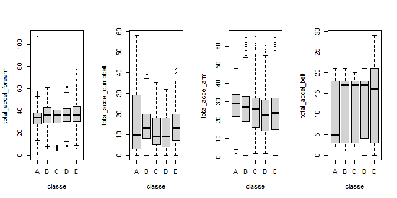
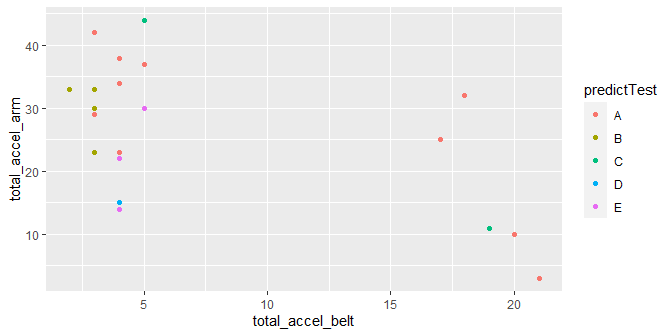

Data source: [http://web.archive.org/web/20161224072740/http:/groupware.les.inf.puc-rio.br/har](http://web.archive.org/web/20161224072740/http:/groupware.les.inf.puc-rio.br/har)

Ugulino, W.; Cardador, D.; Vega, K.; Velloso, E.; Milidiu, R.; Fuks, H. Wearable Computing: Accelerometers' Data Classification of Body Postures and Movements

The data documents the ways in which 6 male participants performed barbell lifts by reading inputs from accelerometers on the belt, forearm, arm, and dumbell of each participant. The data is summarized in the last variable, classe, which has five values, A, B, C, D, and E. Each participant was asked to perform one set of 10 repetitions of a specified exercised in five different manners: exactly according to the specification (Class A), throwing the elbows to the front (Class B), lifting the dumbbell only halfway (Class C), lowering the dumbbell only halfway (Class D) and throwing the hips to the front (Class E).

In this report, I predict the type of class based on the given data. Specifically, I intend to use the total accelerometer data read from belts, forearms, arms, and dumbell accelerometers to predict the ways in which an individual performs the exercise. 

**1. Load data**


```r
url.training <- "https://d396qusza40orc.cloudfront.net/predmachlearn/pml-training.csv"
url.testing <- "https://d396qusza40orc.cloudfront.net/predmachlearn/pml-testing.csv"

if(!file.exists("data")) dir.create("data")

download.file (url.training, destfile = "./data/training")
download.file (url.testing, destfile = "./data/testing")

training <- read.csv("./data/training")
testing <- read.csv("./data/testing")

# dim(training)
# dim(testing)
#head(training)[, c(1:3, 158:160)]
#names(training)
```

**2. EDA**


```r
library(caret)
library(ggplot2)
set.seed(1234)

# [11] "total_accel_belt"
# [49] "total_accel_arm"
# [102] "total_accel_dumbbell" 
# [140] "total_accel_forearm" *
names(training)[140]
```

```
## [1] "total_accel_forearm"
```

```r
#overview
#featurePlot(x=training[, c(11, 49, 102, 140)], y=training$classe, plot="pairs")

#plot 
# qplot(total_accel_belt, total_accel_forearm, color=classe, data=training)
# qplot(total_accel_belt, total_accel_dumbbell, color=classe, data=training)
# qplot(total_accel_belt, total_accel_arm, color=classe, data=training)
# qplot(total_accel_forearm, color=classe, data=training)
# qplot(total_accel_dumbbell, classe, data=training)
# qplot(total_accel_arm, classe, data=training)
# qplot(total_accel_belt, classe, data=training)
par(mfrow=c(1, 4))
boxplot(total_accel_forearm~classe, data=training)
boxplot(total_accel_dumbbell~classe, data=training)
boxplot(total_accel_arm~classe, data=training)
boxplot(total_accel_belt~classe, data=training)
```

<!-- -->

**3. Building a prediction model**  

The panel of plots indicates that the variable total_accel_belt can be useful to identify class A. To a lesser degree,  total_accel_arm + total_accel_forearm can also be useful to identify class A. Given the data distribution, it may not be practical to predit other types of class.  


```r
training$classe <- factor(training$classe)

ctrl <- trainControl (method="cv", number=5)

mod1 <- train(classe~total_accel_belt+total_accel_arm+total_accel_forearm, data=training, list=FALSE, trControl=ctrl)
```

```
## note: only 2 unique complexity parameters in default grid. Truncating the grid to 2 .
```

```r
predictTrain <- predict(mod1, training)
trainingAccuracy <- confusionMatrix(predictTrain, training$classe)
trainingAccuracy
```

```
## Confusion Matrix and Statistics
## 
##           Reference
## Prediction    A    B    C    D    E
##          A 4652  510  475  388  290
##          B  301 2632  375  311  256
##          C  261  309 2116  323  177
##          D  250  234  334 2080  173
##          E  116  112  122  114 2711
## 
## Overall Statistics
##                                           
##                Accuracy : 0.7232          
##                  95% CI : (0.7169, 0.7295)
##     No Information Rate : 0.2844          
##     P-Value [Acc > NIR] : < 2.2e-16       
##                                           
##                   Kappa : 0.6481          
##                                           
##  Mcnemar's Test P-Value : < 2.2e-16       
## 
## Statistics by Class:
## 
##                      Class: A Class: B Class: C Class: D Class: E
## Sensitivity            0.8337   0.6932   0.6184   0.6468   0.7516
## Specificity            0.8816   0.9215   0.9340   0.9396   0.9710
## Pos Pred Value         0.7367   0.6792   0.6642   0.6773   0.8539
## Neg Pred Value         0.9303   0.9260   0.9205   0.9314   0.9455
## Prevalence             0.2844   0.1935   0.1744   0.1639   0.1838
## Detection Rate         0.2371   0.1341   0.1078   0.1060   0.1382
## Detection Prevalence   0.3218   0.1975   0.1624   0.1565   0.1618
## Balanced Accuracy      0.8576   0.8073   0.7762   0.7932   0.8613
```


I built a model for the outcome, classe, with three predictors (total_accel_belt, total_accel_arm, and total_accel_forearm) and used cross validation (k=5) while building the model using trainControl function. The overall accuracy on the training set was 0.72, and its 95% confidence interval was (0.7179, 0.7305). As expected, the Class A had the highest sensitivity(0.83) and the Class C had the lowest sensitivity. 

**4. Evaluation**  

Because the testing data set has no class information, no evaluation can be done. 


```r
predictTest <- predict(mod1, testing)
qplot(x=total_accel_belt, total_accel_arm, color=predictTest, data=testing)
```

<!-- -->


